# An externally accessible virtual machine on Azure, That serves a static HTML page (Linux, Apache)

## Prerequisites
- Cloud Service Provider - Azure.
- Launch a Linux Instance (Ubuntu preferably).
- Prior knowledge on how to SSH into a virtual host.


## STEP 1 -  Create a Virtual Network and Subnet

**1. Navigate to the Azure Portal**

- Open the Azure portal at https://portal.azure.com.

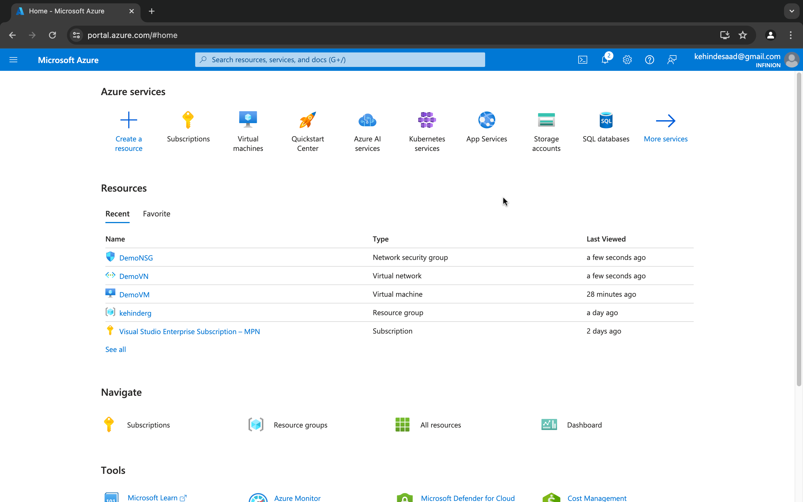

**2. Create a Virtual Network**

- In the home page, click on "Create a resource"

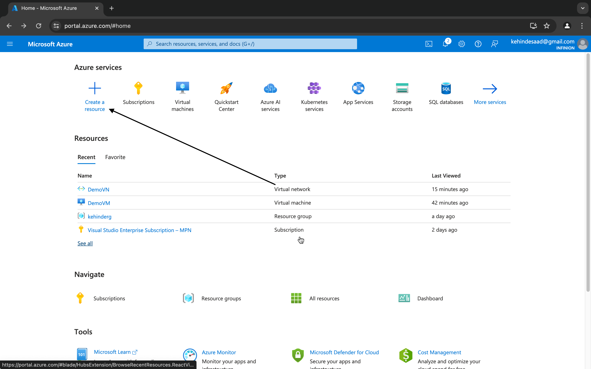

- In the left panel, navigate down to "Networking'

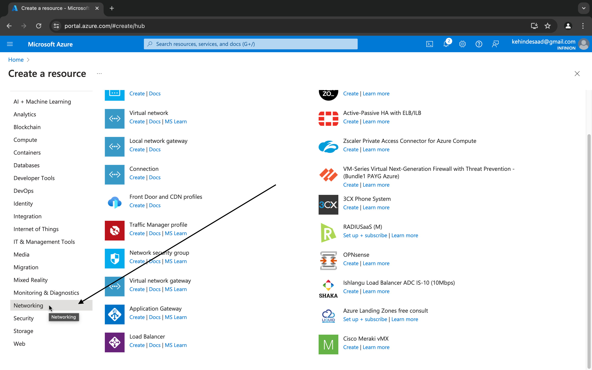

- Click on create virtual network.

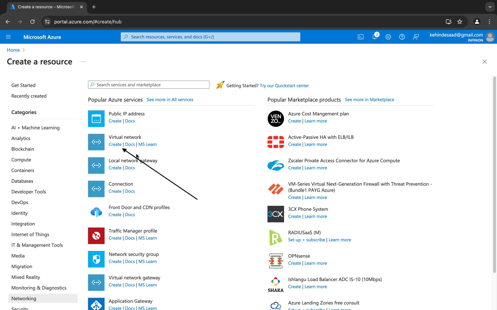

- After clicking on create Virtual network
<!-- UL -->

* Fill the neccessary details
    * Subscription: Your subscription
    * Resource Group: Create new or select an existing one
    * Name: "DemoVN" (Give it a name of your choice)
    * Region: Select a region (e.g. East US)

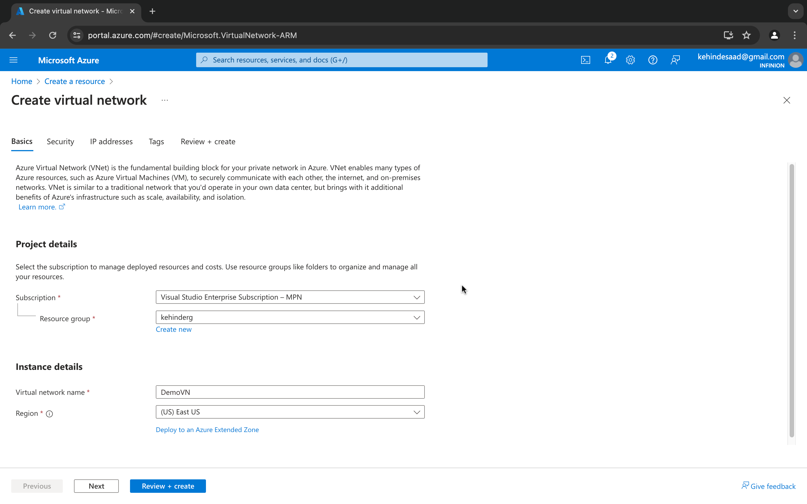

- Under the IP Addresses tab, set the address space (e.g. 10.0.0.0/16).
<!-- UL -->
* Add a subnet:
    * Subnet name: default (Give it a name of your choice, i left mine on default)
    * Subnet address range: 10.0.0.0/24

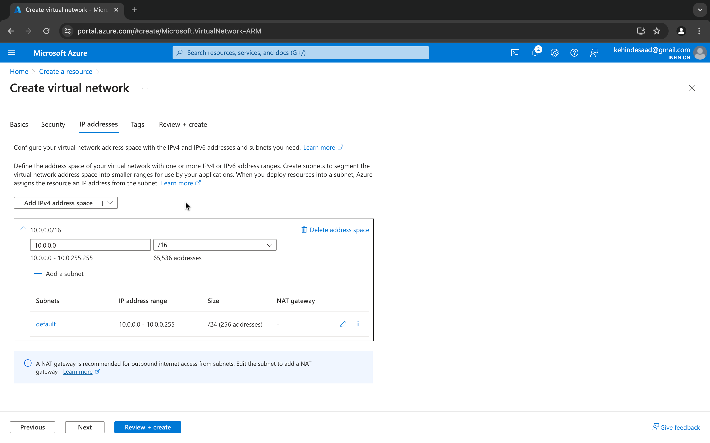

- Click "Review + create", then Create, after creating click on "Go to resource, to get an overview of your virtual network.

## STEP 2 -  Create a Network Security Group (NSG)

**1. Navigate to Network Security Groups:**

- Go back to home, then click on "Create a resource" and navigate down to "Network security group (NSG)"

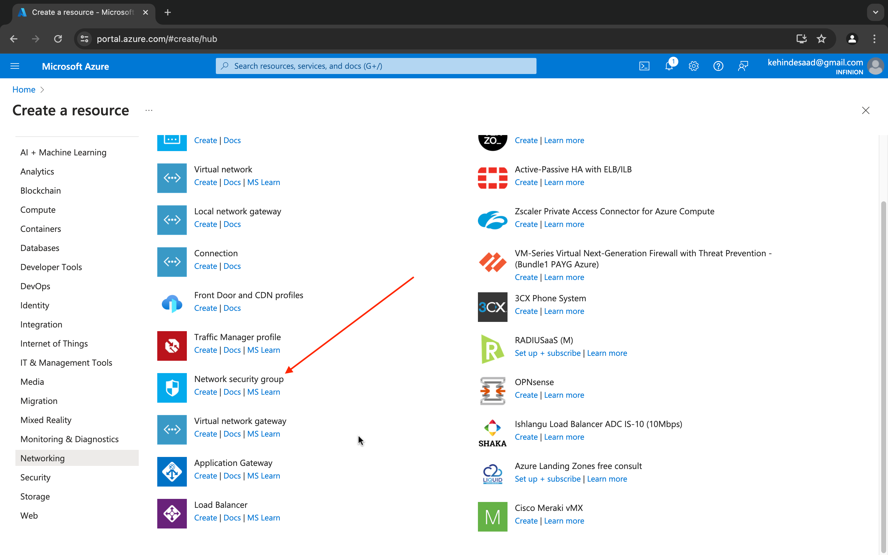

- Click on "Create" to start a new network security group.
<!-- UL -->
* Fill in the necessary details:
    * Subscription: Your subscription
    * Resource Group: Use the same one as the virtual network
    * Name: DemoNSG (Use a name of your choice)
* Click Review + create, and then Create.

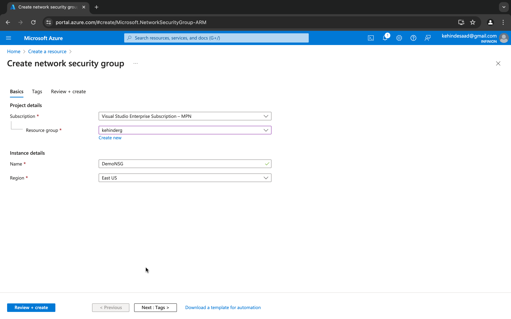

**2. Add an Inbound Security Rule for HTTP:**
<!-- UL -->
* After the NSG is created, go to its resource page.
* Click on Inbound security rules and then Add.
* Configure the rule as follows:
    * Source: Any
    * Source port ranges: *
    * Destination: Any
    * Destination port ranges: 80
    * Protocol: TCP
    * Action: Allow
    * Priority: 1000
    * Name: AllowAnyHTTPInbound (You can choose a name of your choice)
* Click Add.

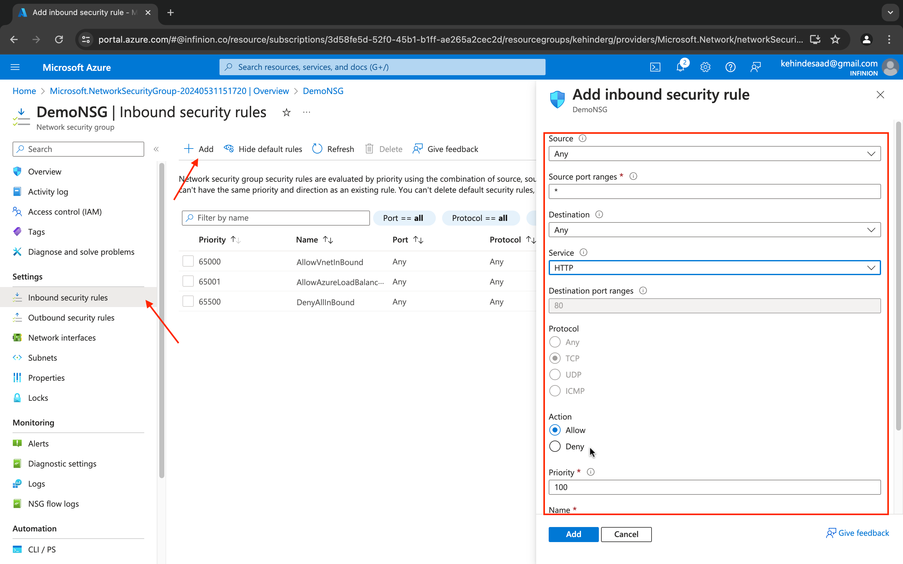

## STEP 3 -  Create the Virtual Machine

**1. Navigate to Virtual Machines:**

- Go back to home, then click on "Create a resource" and navigate down to "Compute", then click on the Ubuntu Server 22.04 LTS
- Click on "Create" 

**2. Configure the Virtual Machine:**
<!-- UL -->
* Basics Tab:
    * Subscription: Your subscription
    * Resource Group: Use the same one as the virtual network
    * Virtual Machine Name: DemoVM (Use a name of your choice)
    * Region: Select the same region as the virtual network
    * Image: Choose Ubuntu Server 22.04 LTS
    * Size: Choose a VM size (e.g., Standard B2s)
    * Authentication Type: SSH public key
    * Username: azureuser (Enter a username of your choice)
    * Key pair name: DemoVMa_key (Enter a name of your choice)
    * Public inbound ports: click "Allow selected ports"
    * Select inbound ports: HTTP and SSH

    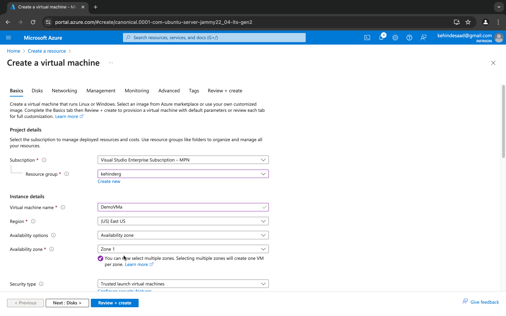

* Networking Tab:
    * Virtual Network: Select the virtual network you created
    * Subnet: Select the subnet you configured
    * Public IP: Create new and provide a name (e.g. DemoVMa-ip)
    * NIC Network Security Group: Select Advanced, then choose the network security group you created
* Click Review + create, and then Create.

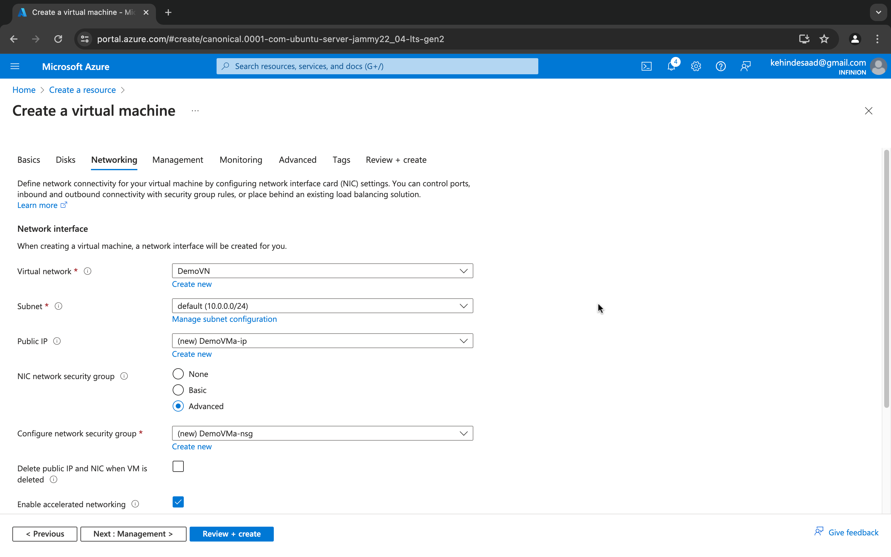

## STEP 4 -  Install and Configure the Web Server

**1. Connect the VM:**

- Obtain the public IP address from the VM's overview page in the Azure portal.
- Ensure your key has the correct read-only access.
``` chmod 400 ~/.ssh/<your-private-key> ``` make sure you state the correct path where your key got downloaded to.

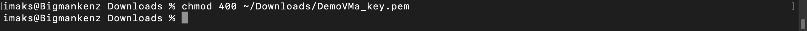

- Connect to the VM via SSH: 

``` ssh -i ~/.ssh/<your-private-key> azureuser@20.127.148.90 ```

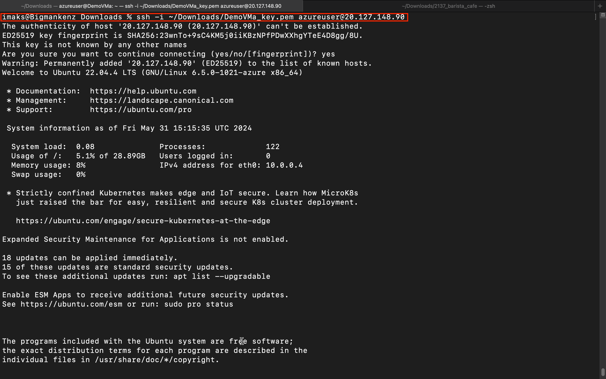

**2. Install Apache or Nginx:**

- For Apache:
```
sudo apt update
sudo apt install apache2 -y
sudo systemctl start apache2
sudo systemctl enable apache2
```

- For Nginx:
```
sudo apt update
sudo apt install nginx -y
sudo systemctl start nginx
sudo systemctl enable nginx
```
**(I used Apache)**

**3. Serve a Static HTML File:**

- For Apache (default document root is /var/www/html), After running the Apache commands, it automatically creates the /var/www/html directories, and inside the html directory is **index.html** file.

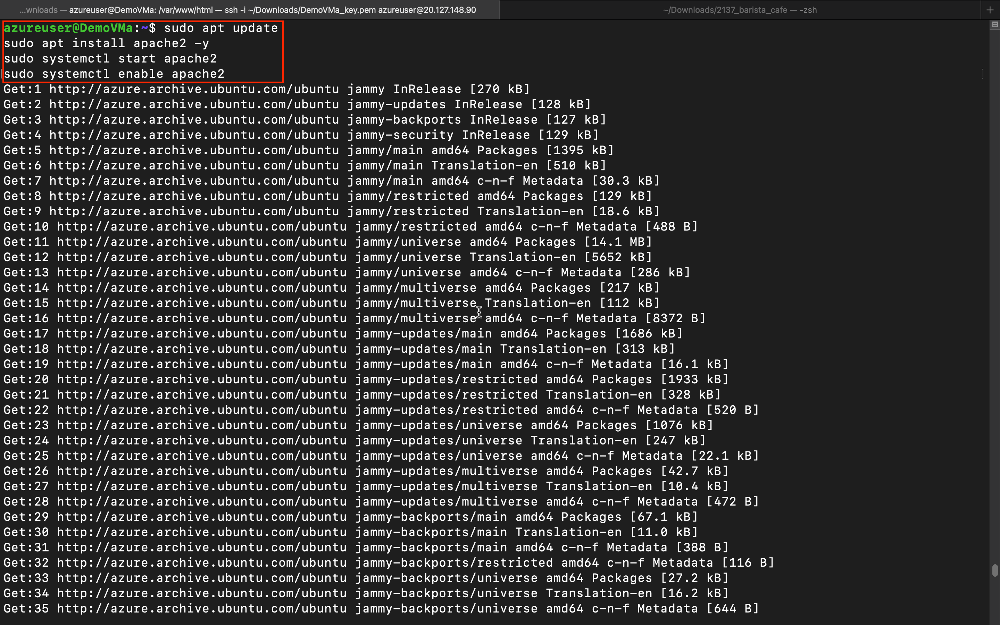
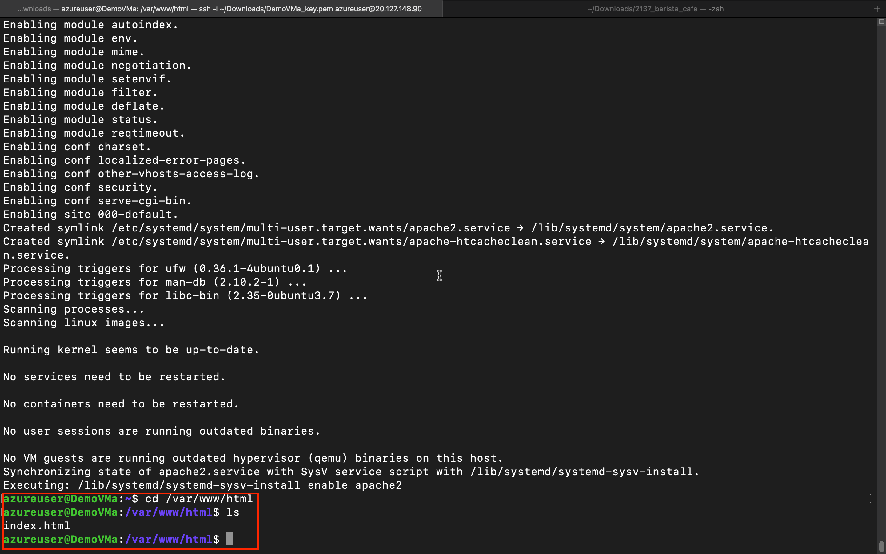

- You can check to comfirm if it is working via your web browser using your Virtual machine's public ip address

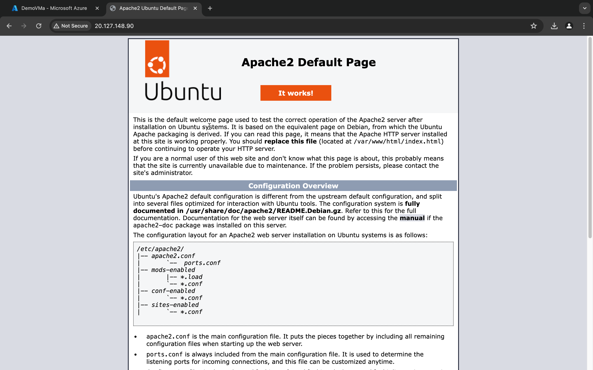

**Configure the page to serve a static HTML**

- Open the **index.html** file in the /vat/www/html directory using `nano` command as follows: ``` nano index.html ```
- Copy and paste the following HTML code inside the index.html file and save: 
``` 
<!DOCTYPE html>
<html lang="en">
  <head>

    <!-- Declared Vars To Go Here -->

    <meta charset="utf-8">
    <meta http-equiv="X-UA-Compatible" content="IE=edge">
    <meta name="viewport" content="width=device-width, initial-scale=1">

    <!-- Metadata -->
    <meta name="description" content="">
    <meta name="author" content="">

    <link rel="icon" href="mysource_files/favicon.ico">

    <!-- Page Name and Site Name -->
    <title>Sa’ad’s static HTML page</title>

    <!-- CSS -->
    <link href="https://maxcdn.bootstrapcdn.com/bootstrap/3.3.6/css/bootstrap.min.css" rel="stylesheet">
    <link href="mysource_files/style.css" rel="stylesheet">

  </head>

  <body>

    <div class="container">

      <header class="header clearfix" style="background-color: #ffffff">

        <!-- Main Menu -->
        <nav>
          <ul class="nav nav-pills pull-right">
            <li class="active"><a href="#">Home</a></li>
            <li><a href="#">About</a></li>
            <li><a href="#">Contact</a></li>
          </ul>
        </nav>

        <!-- Site Name -->
        <h1 class="h3 text-muted">Site Name</h1>

        <!-- Breadcrumbs -->
        <ol class="breadcrumb">
          <li><a href="#">Home</a></li>
          <li><a href="#">Level 1</a></li>
          <li class="active">Level 2</li>
        </ol>

      </header>

      <div class="page-heading">

        <!-- Page Heading -->
        <h1>Page Heading</h1>

      </div>

      <div class="row">

        <div class="col-sm-3">

          <!-- Sub Navigation -->
          <ul class="nav nav-pills nav-stacked">
            <li><a href="#">Level 2</a></li>
            <li class="active"><a href="#">Level 2</a>
              <ul>
                <li><a href="#">Level 3</a></li>
                <li><a href="#">Level 3</a></li>
                <li><a href="#">Level 3</a></li>
              </ul>
            </li>
            <li><a href="#">Level 2</a></li>
          </ul>

        </div>

        <div class="col-sm-6">

          <div class="page-contents">

            <!-- Design Body -->
            <h2>Sub Heading</h2>
            <p>The cloud infrastructure tasks at INFINION technologies</p>
            <h4>Sub Heading</h4>
            <p>Infinion technologies is the leading tech company in Nigeria</p>
            <h4>Sub Heading</h4>
            <p>My name is Olohungbebe Kehinde Sa’adudeen, thank you for this opportunity</p>

          </div>

        </div>

        <div class="col-sm-3">

          <!-- Login Section -->
          <h2>Login</h2>

          <!-- Search Section -->
          <h2>Search</h2>

          <!-- Nested Right Column Content -->

        </div>

      </div>
    </div> <!-- /container -->

  </body>
</html>
```
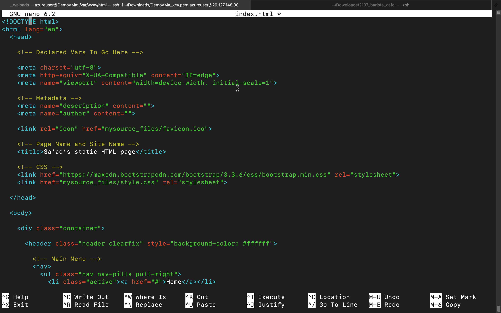

## STEP 5 -  Verify Access to your Static page

**1. Open a Web Browser:**
<!-- UL -->
* Copy the public IP address of your VM.
    
    * Enter the public IP address of your VM in the browser's address bar.
    * You should see the content of your index.html file displayed, indicating that the web server is serving the static HTML file correctly.

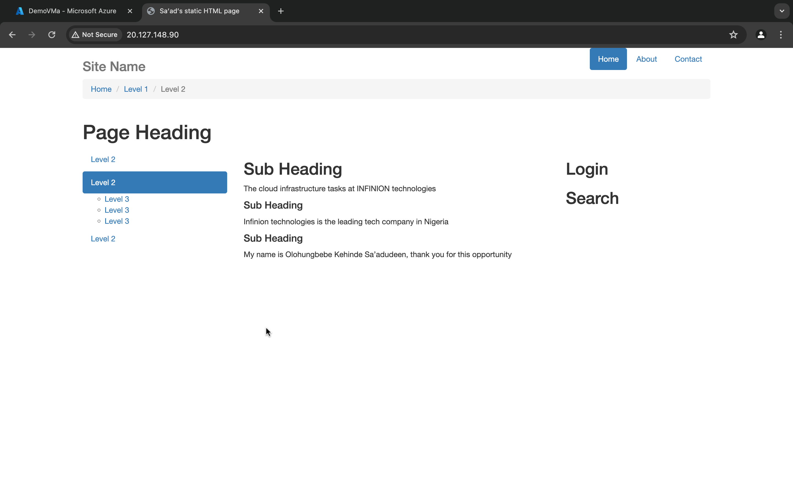


- For **NGINX** do the same

